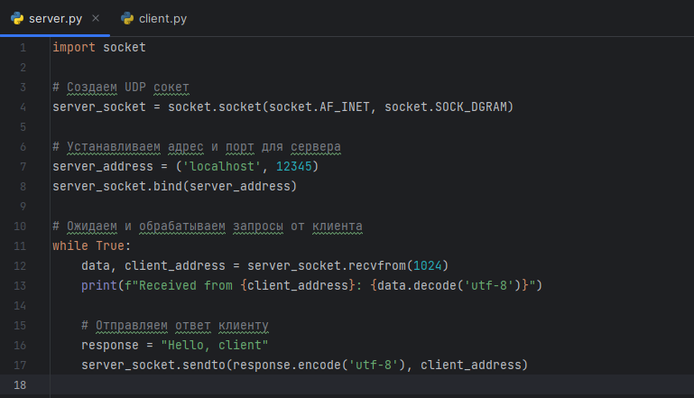
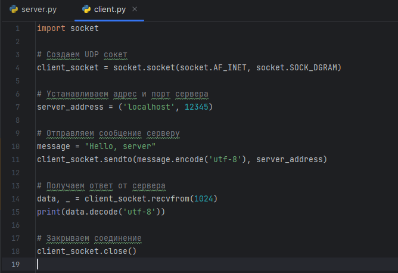
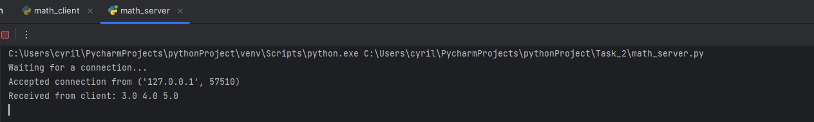
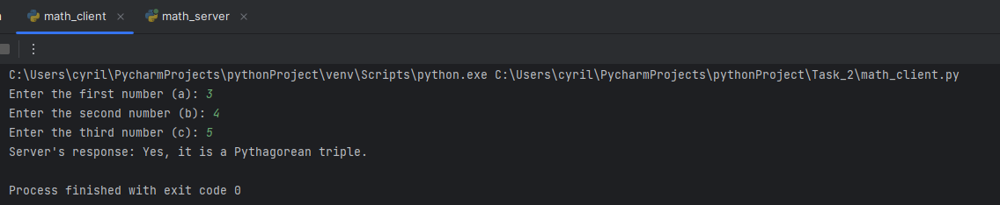
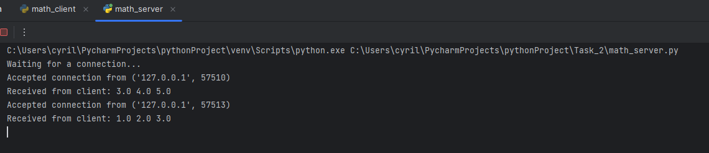
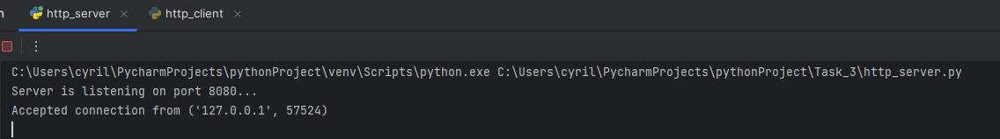
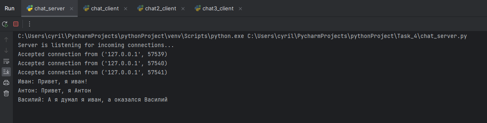
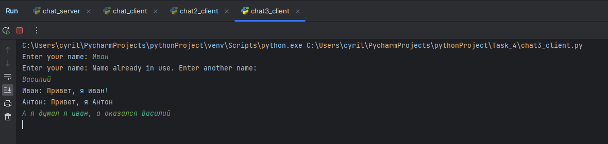
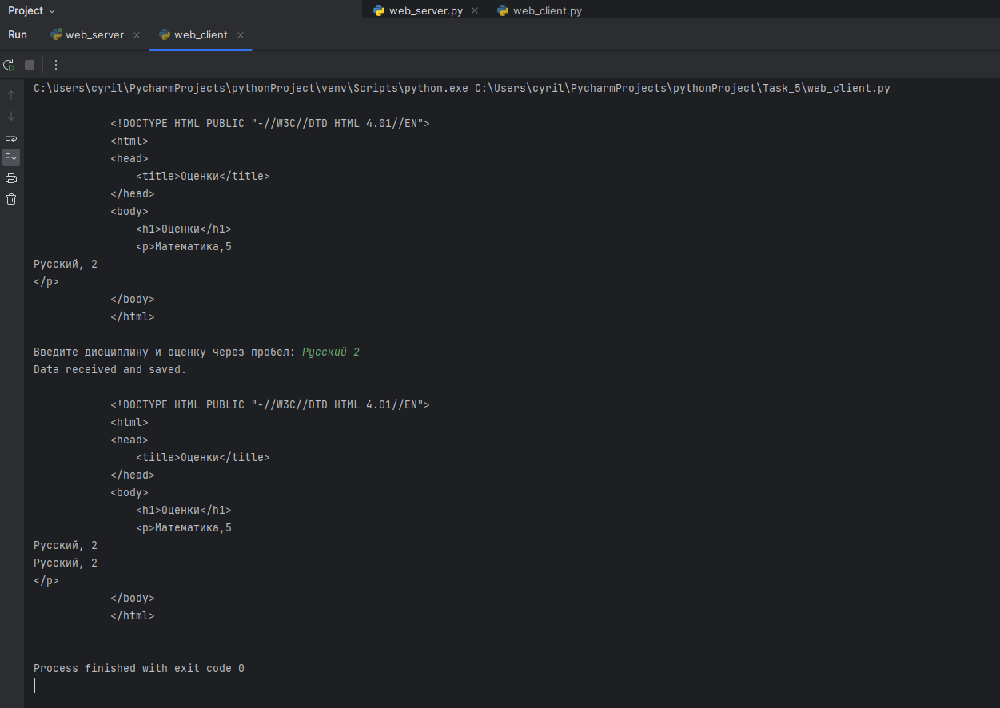

> **САНКТ-ПЕТЕРБУРГСКИЙ** **НАЦИОНАЛЬНЫЙ** **ИССЛЕДОВАТЕЛЬСКИЙ**
> **УНИВЕРСИТЕТ** **ИТМО**
>
> **Дисциплина:** Web разработка
>
> Отчет
>
> Лабораторная работа №1
>
> Выполнил:
>
> Зайцев Кирилл Дмитриевич
>
> Группа: К33402
>
> Проверил: Говоров.А.И
>
> Санкт-Петербург
>
> 2023 г.

Практическое задание:

1\. Реализовать клиентскую и серверную часть приложения. Клиент отсылает
серверу сообщение «Hello, server». Сообщение должно отразиться на
стороне сервера. Сервер в ответ отсылает клиенту сообщение «Hello,
client». Сообщение должно отобразиться у клиента. Обязательно
использовать библиотеку socket

Реализовать с помощью протокола UDP

**Выполнение** **задания:**

{width="6.270138888888889in"
height="3.595138888888889in"}Код сервера:

{width="6.270138888888889in"
height="4.298611111111111in"}{width="6.270138888888889in"
height="0.43472112860892387in"}

Код клиента:

Консоль сервера:

{width="6.270138888888889in"
height="1.0298600174978128in"}Консоль клиента:

2\. Реализовать клиентскую и серверную часть приложения. Клиент
запрашивает у сервера выполнение математической операции, параметры,
которые вводятся с клавиатуры. Сервер обрабатывает полученные данные и
возвращает результат

клиенту. Варианты:

a\. Теорема Пифагора

Обязательно использовать библиотеку socket

Реализовать с помощью протокола TCP

Код сервера: import socket

\# Создаем TCP сокет

server_socket = socket.socket(socket.AF_INET, socket.SOCK_STREAM)

\# Устанавливаем адрес и порт для сервера server_address =
(\'localhost\', 12345) server_socket.bind(server_address)

\# Слушаем подключения server_socket.listen(5) print(\"Waiting for a
connection\...\")

while True:

> \# Принимаем клиентское соединение
>
> client_socket, client_address = server_socket.accept()
> print(f\"Accepted connection from {client_address}\")
>
> \# Принимаем данные от клиента
>
> data = client_socket.recv(1024).decode(\'utf-8\') print(f\"Received
> from client: {data}\")
>
> \# Разбираем данные, ожидая три числа (a, b, c) try:
>
> a, b, c = map(float, data.split()) except ValueError:

response = \"Invalid input. Please enter three numbers separated by
spaces.\"

> else:
>
> \# Проверяем, являются ли числа решением теоремы Пифагора
> is_pythagorean = a\*\*2 + b\*\*2 == c\*\*2

response = \"Yes, it is a Pythagorean triple.\" if is_pythagorean else
\"No, it is not a Pythagorean triple.\"

> \# Отправляем ответ клиенту
> client_socket.send(response.encode(\'utf-8\'))
>
> \# Закрываем соединение с клиентом client_socket.close()

{width="6.270138888888889in"
height="0.9423611111111111in"}{width="6.270138888888889in"
height="1.2916655730533684in"}

Код клиента: import socket

\# Создаем TCP сокет

client_socket = socket.socket(socket.AF_INET, socket.SOCK_STREAM)

\# Устанавливаем адрес и порт сервера server_address = (\'localhost\',
12345) client_socket.connect(server_address)

\# Вводим три числа (a, b, c)

a = float(input(\"Enter the first number (a): \")) b =
float(input(\"Enter the second number (b): \")) c = float(input(\"Enter
the third number (c): \"))

\# Отправляем данные серверу message = f\"{a} {b} {c}\"

client_socket.send(message.encode(\'utf-8\'))

\# Получаем ответ от сервера

result = client_socket.recv(1024).decode(\'utf-8\') print(f\"Server\'s
response: {result}\")

\# Закрываем соединение client_socket.close()

При вводе пифагоровой тройки:

Консоль сервера:

Консоль клиента:

При неправильном вводе:

Консоль сервера:

{width="6.270138888888889in"
height="1.358332239720035in"}{width="6.270138888888889in"
height="1.275693350831146in"}

Консоль клиента:

3\. Реализовать серверную часть приложения. Клиент подключается к
серверу. В ответ клиент получает http-сообщение, содержащее
html-страницу, которую сервер подгружает из файла index.html.
Обязательно использовать библиотеку socket

Код сервера: import socket import threading import os

\# Путь к файлу index.html html_file_path = \"index.html\"

\# Создаем TCP сокет

server_socket = socket.socket(socket.AF_INET, socket.SOCK_STREAM)

\# Устанавливаем адрес и порт сервера server_address = (\'localhost\',
8080) server_socket.bind(server_address)

\# Слушаем подключения server_socket.listen(1)

print(\"Server is listening on port 8080\...\")

def handle_client(client_socket): \# Принимаем данные от клиента

> data = client_socket.recv(1024).decode(\'utf-8\')
>
> if \"GET / HTTP/1.1\" in data:
>
> \# Отправляем содержимое файла index.html if
> os.path.exists(html_file_path):
>
> with open(html_file_path, \'r\') as file:
>
> content = file.read()

response = f\"HTTP/1.1 200 OK\\r\\nContent-Type:
text/html\\r\\n\\r\\n{content}\"

> else:
>
> response = \"HTTP/1.1 404 Not Found\\r\\n\\r\\nFile not found\" else:
>
> \# Если запрос не соответствует ожидаемому, отправляем ошибку response
> = \"HTTP/1.1 400 Bad Request\\r\\n\\r\\nBad Request\"
>
> \# Отправляем ответ клиенту
> client_socket.send(response.encode(\'utf-8\')) client_socket.close()

while True:

> \# Принимаем клиентское соединение
>
> client_socket, client_address = server_socket.accept()
> print(f\"Accepted connection from {client_address}\")
>
> \# Создаем отдельный поток для каждого клиента client_thread =
> threading.Thread(target=handle_client,

args=(client_socket,)) client_thread.start()

Код клиента: import socket

\# Создаем TCP сокет

client_socket = socket.socket(socket.AF_INET, socket.SOCK_STREAM)

\# Устанавливаем адрес и порт сервера, к которому хотим подключиться
server_address = (\'localhost\', 8080)

try:

> \# Подключаемся к серверу client_socket.connect(server_address)
>
> \# Формируем HTTP-запрос
>
> request = \"GET / HTTP/1.1\\r\\nHost: localhost\\r\\n\\r\\n\"
>
> \# Отправляем запрос серверу
> client_socket.sendall(request.encode(\'utf-8\'))
>
> \# Получаем ответ от сервера и выводим его
>
> response = client_socket.recv(1024).decode(\'utf-8\') print(response)

except Exception as e:

> print(f\"An error occurred: {e}\")

finally:

> \# Закрываем соединение с сервером client_socket.close()

{width="6.270138888888889in"
height="0.8777777777777778in"}{width="6.270138888888889in"
height="2.656943350831146in"}

Консоль сервера:

Консоль клиента:

4\. Реализовать двухпользовательский или многопользовательский чат.
Реализация многопользовательского часа позволяет получить максимальное
количество баллов. Обязательно использовать библиотеку

Реализовать с помощью протокола TCP -- 100% баллов, с помощью UDP --
80%.

Обязательно использовать библиотеку threading.

Для реализации с помощью UDP, thearding использовать для получения
сообщений у клиента.

Для применения с TCP необходимо запускать клиентские подключения И прием
и отправку сообщений всем юзерам на сервере в потоках. Не забудьте
сохранять юзеров, чтобы потом отправлять им сообщения.

**Выполнение:**

Код сервера: import socket import threading

\# Создаем TCP сокет

server_socket = socket.socket(socket.AF_INET, socket.SOCK_STREAM)

\# Устанавливаем адрес и порт сервера server_address = (\'localhost\',
12345) server_socket.bind(server_address)

\# Слушаем подключения server_socket.listen(5)

print(\"Server is listening for incoming connections\...\")

\# Словарь для хранения имен клиентов и их соответствующих соксетов
clients = {}

def handle_client(client_socket): \# Запрос имени у клиента

> client_socket.send(\"Enter your name: \".encode(\'utf-8\')) name =
> client_socket.recv(1024).decode(\'utf-8\')
>
> \# Проверка уникальности имени while name in clients:

client_socket.send(\"Name already in use. Enter another name:
\".encode(\'utf-8\'))

> name = client_socket.recv(1024).decode(\'utf-8\')
>
> clients\[name\] = client_socket
>
> while True: try:
>
> data = client_socket.recv(1024) if not data:
>
> break
>
> message = data.decode(\'utf-8\') print(f\"{name}: {message}\")
>
> \# Отправляем сообщение всем другим клиентам
>
> for other_name, other_client in clients.items(): if other_name !=
> name:
>
> other_client.send(f\"{name}: {message}\".encode(\'utf-8\')) except
> Exception as e:
>
> print(f\"An error occurred: {e}\") break
>
> \# Удаляем клиента из списка после отключения del clients\[name\]
>
> client_socket.close()

while True:

> \# Принимаем клиентское соединение
>
> client_socket, client_address = server_socket.accept()
> print(f\"Accepted connection from {client_address}\")
>
> \# Создаем отдельный поток для каждого клиента client_thread =
> threading.Thread(target=handle_client,

{width="6.270138888888889in"
height="1.5951388888888889in"}

args=(client_socket,)) client_thread.start()

Код клиентов: import socket import threading

\# Создаем TCP сокет

client_socket = socket.socket(socket.AF_INET, socket.SOCK_STREAM)

\# Устанавливаем адрес и порт сервера server_address = (\'localhost\',
12345)

\# Подключаемся к серверу client_socket.connect(server_address)

\# Запрашиваем имя у пользователя name = input(\"Enter your name: \")

client_socket.send(name.encode(\'utf-8\'))

def receive_messages(): while True:

> try:
>
> data = client_socket.recv(1024) message = data.decode(\'utf-8\')
> print(message)
>
> except Exception as e:
>
> print(f\"An error occurred: {e}\") break

\# Создаем поток для приема сообщений от сервера receive_thread =
threading.Thread(target=receive_messages) receive_thread.start()

while True:

> message = input() client_socket.send(message.encode(\'utf-8\'))

Консоль сервера:

Консоли клиентов:

{width="6.270138888888889in"
height="1.523611111111111in"}{width="6.270138888888889in"
height="1.6409722222222223in"}{width="6.270138888888889in"
height="1.4874989063867017in"}

5\. Необходимо написать простой web-сервер для обработки GET и POST http
запросов средствами Python и библиотеки socket.

Задание: сделать сервер, который может:

● Принять и записать информацию о дисциплине и оценке по дисциплине.

● Отдать информацию обо всех оценках по дсисциплине в виде
html-страницы.

Код сервера: import http.server import socketserver

\# Устанавливаем порт, на котором будет работать сервер PORT = 8080

\# Создаем обработчик запросов для сервера

class RequestHandler(http.server.SimpleHTTPRequestHandler): def
do_POST(self):

> \# Обрабатываем POST-запрос
>
> content_length = int(self.headers\[\'Content-Length\'\]) post_data =
> self.rfile.read(content_length).decode(\'utf-8\')
>
> \# Добавляем данные в файл grades.txt with open(\'grades.txt\', \'a\')
> as file:
>
> file.write(post_data + \'\\n\')
>
> \# Отправляем клиенту ответ self.send_response(200) self.end_headers()
>
> self.wfile.write(bytes(\"Data received and saved.\", \'utf-8\'))
>
> def do_GET(self):
>
> \# Обрабатываем GET-запрос if self.path == \'/\':
>
> \# Открываем файл grades.txt и читаем данные из него with
> open(\'grades.txt\', \'r\') as file:
>
> data = file.read()
>
> \# Генерируем HTML-страницу на основе данных из файла html = f\"\"\"
>
> \<!DOCTYPE HTML PUBLIC \"-//W3C//DTD HTML 4.01//EN\"\> \<html\>
>
> \<head\> \<title\>Оценки\</title\>
>
> \</head\> \<body\>
>
> \<h1\>Оценки\</h1\> \<p\>{data}\</p\>
>
> \</body\> \</html\> \"\"\"
>
> \# Отправляем клиенту HTML-страницу self.send_response(200)
> self.send_header(\"Content-type\", \"text/html\") self.end_headers()
> self.wfile.write(html.encode(\'utf-8\'))
>
> else:
>
> \# Если запрос не на корневой URL, обработка не поддерживается
> self.send_response(404)
>
> self.end_headers()

\# Создаем сервер с указанным портом и обработчиком запросов

with socketserver.TCPServer((\"\", PORT), RequestHandler) as httpd:
print(f\"Serving at port {PORT}\")

> \# Запускаем сервер httpd.serve_forever()

Код клиента: import http.client

\# Адрес и порт сервера SERVER_ADDRESS = \"localhost:8080\"

def send_get_request(path=\"/\"):

> \# Создаем соединение с сервером
>
> conn = http.client.HTTPConnection(SERVER_ADDRESS)
>
> \# Отправляем GET-запрос conn.request(\"GET\", path)
>
> \# Получаем и выводим ответ от сервера response = conn.getresponse()
> print(response.read().decode(\'utf-8\'))
>
> conn.close()

def send_post_request():

> \# Запрашиваем данные о дисциплине и оценке с клавиатуры

discipline, grade = input(\"Введите дисциплину и оценку через пробел:
\").split()

> data = f\"{discipline}, {grade}\"
>
> \# Создаем соединение с сервером
>
> conn = http.client.HTTPConnection(SERVER_ADDRESS)
>
> \# Преобразуем данные в байты с использованием UTF-8 кодировки data =
> data.encode(\'utf-8\')
>
> \# Отправляем POST-запрос с данными
>
> headers = {\'Content-type\': \'text/plain; charset=utf-8\'}
> conn.request(\"POST\", \"/\", data, headers)
>
> \# Получаем и выводим ответ от сервера response = conn.getresponse()
> print(response.read().decode(\'utf-8\'))
>
> conn.close()

\# Примеры запросов:

\# Отправляем GET-запрос для получения оценок send_get_request()

\# Отправляем POST-запрос для добавления оценки send_post_request()

\# Отправляем GET-запрос для проверки, что оценка добавлена
send_get_request()

{width="6.270138888888889in"
height="1.3958333333333333in"}

Консоль сервера:

{width="6.270138888888889in"
height="4.44027668416448in"}Консоль клиента:

**Вывод**

В ходе выполнения заданий были рассмотрены различные аспекты сетевого
программирования с использованием библиотеки socket в языке
программирования Python.

Вот краткий вывод по проделанной работе:

Протокол UDP:

Мы реализовали клиент-серверное приложение с использованием протокола
UDP. Протокол UDP обеспечивает более быструю передачу данных, но не
гарантирует их надежную доставку. Это подходит для сценариев, где
небольшие задержки важнее надежности, например, для передачи потокового
видео.

Протокол TCP:

Мы создали клиент-серверное приложение с использованием протокола TCP.
TCP обеспечивает надежную и устойчивую передачу данных с установлением
соединения, подтверждением доставки и управлением порядком. Этот
протокол

подходит для сценариев, где надежность и порядок передачи данных
приоритетны.

Работа с HTTP:

Мы создали простой HTTP-сервер, который может обрабатывать GET и POST
запросы, а также генерировать HTML-страницы на основе данных из файла.
Этот опыт позволил нам понять, как работают базовые принципы
веб-серверов и обработки HTTP-запросов.

Многопользовательский чат:

Мы реализовали многопользовательский чат, используя как протокол TCP,
так и библиотеку threading. Этот опыт показал, как можно создавать
сетевые приложения для обмена сообщениями между клиентами.

Задание на запись и отображение оценок:

Мы создали сервер, который может принимать и записывать информацию о
дисциплине и оценке по дисциплине в файл grades.txt, а также отдавать
информацию в виде HTML-страницы.

Работа с библиотекой http.client:

Мы научились создавать клиентские приложения, отправлять GET и POST
запросы к серверам и обрабатывать их ответы с использованием библиотеки
http.client.

В результате выполнения этих заданий мы приобрели навыки в сетевом
программировании и обработке HTTP-запросов, а также понимание различий
между протоколами UDP и TCP. Эти навыки могут быть полезными при
разработке сетевых приложений и веб-серверов.
