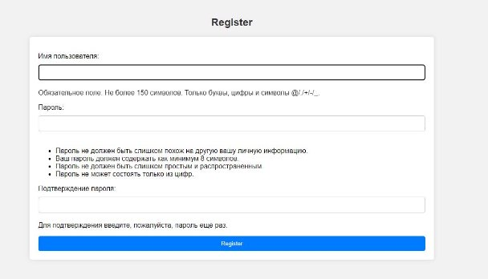
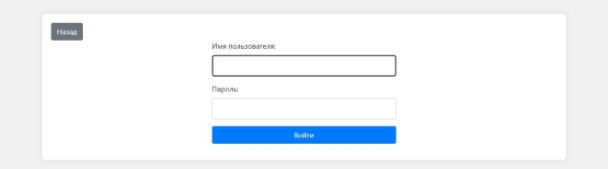
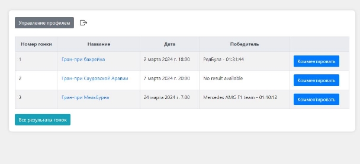
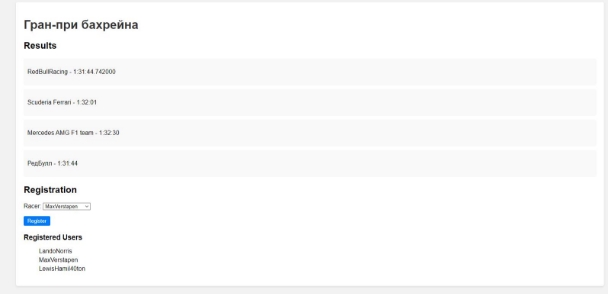
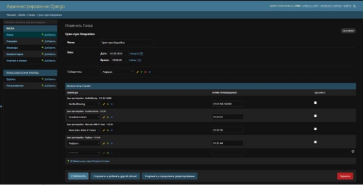

**САНКТ-ПЕТЕРБУРГСКИЙ НАЦИОНАЛЬНЫЙ ИССЛЕДОВАТЕЛЬСКИЙ УНИВЕРСИТЕТ ИТМО** 

**Дисциплина:** Web разработка Отчет 

Лабораторная работа № 2  

Выполнил: Зайцев Кирилл Дмитриевич 

Группа: К33402 

Проверил: Говоров.А.И 

Санкт-Петербург 2023 г.

Практическое задание: 

Реализовать сайт используя фреймворк Django 3 и СУБД PostgreSQL \*, в соответствии  с  вариантом  задания  лабораторной  работы. Вариант  6: Табло победителей автогонок - Табло должно отображать информацию об участниках  автогонок:  ФИО  участника,  название  команды,  описание автомобиля,  описание  участника,  опыт  и  класс  участника.  Необходимо реализовать следующий функционал: 

- Регистрация новых пользователей. 
- Просмотр автогонок и регистрацию гонщиков. Пользователь должен иметь возможность редактирования и удаления своих регистраций. 
- Написание отзывов и комментариев к автогонкам. Предварительно 

комментатор должен зарегистрироваться. При добавлении комментариев должны сохраняться даты заезда, текст комментария, тип комментария 

(вопрос  о  сотрудничестве,  вопрос  о  гонках,  иное),  рейтинг  (1-10), 

информация о комментаторе. 

- Администратор должен иметь возможность указания времени заезда и 

результата средствами Django-admin. 

- В клиентской части должна формироваться таблица всех заездов и 

результатов конкретной гонки. 

**Выполнение задания:** 

В ходе выполнения работы над проектом было сделано следующее:   

1. Модели данных: Были определены модели данных для гонок (Race), результатов гонок (RaceResult), команд (Team), гонщиков (Racer), участия в гонке (RaceEntry) и комментариев (Comment). Эти модели описывают основные сущности приложения и их отношения.   
1. Формы: Были созданы формы для регистрации пользователей (RegistrationForm), входа в систему, изменения профиля (ProfileUpdateForm) и смены пароля (PasswordChangeCustomForm). Также была создана форма для комментариев (CommentForm) и участия в гонке (RaceEntryForm).   
1. Представления: Были определены представления для различных действий в приложении, такие как регистрация пользователя, отображение списка гонок, отображение деталей гонки, добавление и просмотр комментариев к гонке, управление участием в гонке и профилем пользователя. Также было добавлено представление для отображения общих результатов всех гонок.   
1. Шаблоны: Для каждого представления были созданы соответствующие HTML-шаблоны, оформленные в соответствии с дизайном приложения. 
1. Административный интерфейс: Были зарегистрированы модели в административном интерфейсе Django для управления данными через веб-интерфейс.   
1. Статические файлы: Были добавлены статические файлы (CSS, изображения и JavaScript), чтобы стилизовать и обогатить пользовательский интерфейс.   
1. Обработка ошибок: Была добавлена обработка ошибок в формах и представлениях для обеспечения корректного взаимодействия с пользователем.   
1. Регистрация и аутентификация пользователей: Была добавлена функциональность регистрации и аутентификации пользователей, а также возможность изменения пароля и профиля. 

Скриншоты полученного сайта: 

Рисунок 1 – Главная страница 

Рисунок 2 – Страница регистрации 

Рисунок 3 – Страница входа 

Рисунок 4 – Страница со списком всех гонок 

Рисунок 5 – Страница с подробными данными гонки 

Рисунок 6 – Страница комментариев гонки 

Рисунок 7 – Панель Django admin 

**Вывод**

В ходе выполнения данного практического задания был разработан сайт для отображения информации о гоночных соревнованиях, соответствующий требованиям варианта 6 лабораторной работы. Веб- приложение реализовано с использованием фреймворка Django 3.  Основные функциональные возможности сайта включают:   

1. Регистрацию новых пользователей с использованием формы регистрации.  
1. Просмотр информации о гоночных событиях, включая список гонок, результаты и возможность регистрации/снятия регистрации на гонку.  
1. Написание отзывов и комментариев к гоночным событиям после регистрации. Комментарии сохраняют информацию о дате, тексте, типе комментария, рейтинге и комментаторе.  
1. Возможность администратора указывать время заезда и результаты с помощью Django-admin.  
1. Формирование таблицы всех заездов и результатов конкретной гонки на клиентской стороне.  

Была разработана структура базы данных, включающая модели Team, Racer, Race, RaceResult, RaceEntry и Comment, а также соответствующие формы и представления для реализации заданных функциональностей. Сайт имеет адаптивный дизайн и может быть легко масштабирован для добавления новых функций в будущем.   

В целом, выполнение данного задания позволило освоить основы разработки веб-приложений на основе Django и применить полученные знания на практике для создания функционального веб-сайта.  
